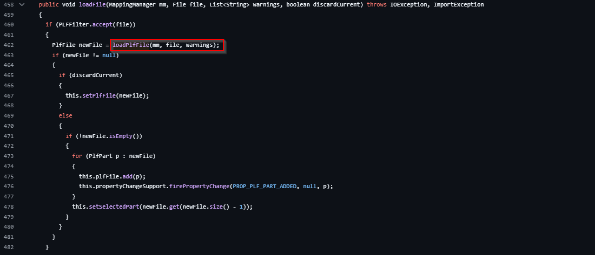

# Introduction to VisiCut

VisiCut is an open-source software designed to streamline the preparation and transmission of designs to laser cutters. It offers a user-friendly interface for importing design files, tweaking cutting parameters, and managing compatible laser cutter hardware. Supporting a variety of laser cutter models, VisiCut is a versatile tool for hobbyists, makers, and professionals in prototyping, manufacturing, and design. It is available on Linux, macOS, and Windows, with particular popularity among Linux users via a `.deb` package. Hosted on GitHub, its open-source nature ensures regular updates and wide accessibility.

# Understanding the CVE-2025-25940

CVE-2025-25940 is a critical vulnerability in VisiCut 2.1, identified in January 2025. It stems from insecure XML deserialization within the `loadPlfFile` method in `VisicutModel.java`. The software unsafely uses `java.beans.XMLDecoder` to process XML input from `.plf` files. Loading a malicious `.plf` file with a harmful `transform.xml` can trigger arbitrary code execution, potentially granting attackers remote access to a user’s system. This flaw’s severity lies in its exploitation simplicity—tricking a user into opening a file—posing risks like system compromise or laser cutter damage.

# PLF Archives

`.plf` files, or **VisiCut Portable Laser Format** files, are zip archives that bundle design data, configurations, and transformations for laser cutting tasks. They typically contain:

- **Design Files**: Vector or raster files (e.g., SVG, DXF) defining cutting patterns.
- **Transformations**: Instructions in `transform.xml` for positioning or scaling designs.
- **Mappings**: Settings in `mapping.xml` linking designs to laser parameters (e.g., power, speed).
- **Metadata**: Project details like file paths or indices.

# Root Cause of the Vulnerability

The vulnerability originates from inadequate sanitization of `.plf` files. In `VisicutModel.java`, the `loadPlfFile` method deserializes `transform.xml` using `XMLDecoder` without validation. 

 
This lack of checks extends to the `loadFile` function, invoked via the GUI’s "Open" feature, allowing malicious XML to execute arbitrary code upon loading.

# Proof of Concept

To summarize, **CVE-2025-25940** is prized for its **remote code execution** potential and **hardware control implications**. Below is a Proof of Concept (PoC) with detailed exploitation steps for CVE-2025-25940, a critical vulnerability in VisiCut 2.1. The vulnerability stems from insecure XML deserialization in the **loadPlfFile** method of **VisicutModel.java**, allowing an attacker to execute arbitrary code by crafting a malicious .plf file. When loaded into VisiCut, this file can trigger remote code execution (RCE), potentially compromising the victim's system or connected hardware like laser cutters.Exploitation steps include:

### Crafting a Malicious `.plf` File:
Build a `.plf` zip with a malicious `transform.xml` exploiting `XMLDecoder` for running commands on the given system.
   - **On Linux**:  
     zip malicious.plf transform.xml
      
     
      
   - **On Windows**:  
     Zip as `.zip`, then rename to `.plf`.

### Delivery Mechanism:
In real life scenarios we can use social engineering (e.g., phishing with **"FinalWorkBenchDesign.plf"**) to lure users into opening the file via VisiCut’s GUI.
 
Here, we open the file with the VisiCut Software, either through the drop-down or open-with the software.

### Exploitation:
- Upon opening, `loadPlfFile` executes the payload. In the given scenario, a file **"visicut.txt"** gets created under **"/tmp"**
   
  
   
  

### Mitigation Strategies

- **Patch and Update**  
  - **Action:** Upgrade to a patched version of **VisiCut** once available, monitoring the GitHub repository for fixes.  

- **Replace XMLDecoder**  
  - **Action:** Eliminate the use of **XMLDecoder** for untrusted input, opting for safer deserialization formats like **JSON** that don’t allow arbitrary code execution.  

- **Validate Input**  
  - **Action:** Add strict validation to ensure **transform.xml** conforms to an expected structure, rejecting malformed or malicious content. We can use **whitelisting** or **schema validation** to block payloads.  

- **User Awareness**  
  - **Action:** Educate users not to open **.plf** files from untrusted sources, or if necessary, thoroughly inspect the file contents before running.  
>>>>>>> cc6f055 (Adding files for the VisiCut Demo)
